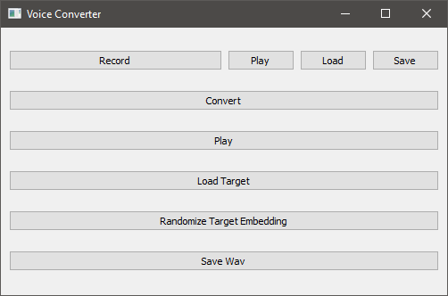

# API
This repository contains code for the Seminar Audio Processing and Indexing 2021 final project at Leiden University. As a part of this project, we investigate voice style transfer systems. We aim to create an easy-to-use conversion program utilising the [AutoVC](https://github.com/auspicious3000/autovc) voice conversion model.

Audio samples will be posted [here](https://woutah.github.io/API/)


## Interface

We implemented an easy-to-use tool which can be used to generate audio  samples on-demand by inputting either `.wav`-files, or by recording these samples directly via a microphone.

The tool can be started by running

```
python --model_path ./path/to/melgan.ckpt --target_embedding_path ./path/to/target_emb.npy --source_embedding_path ./path/to/source_emb.npy
```

Where:

``model_path`` - The location of the trained autoVC model-checkpoint (trained on Melgan spectrograms)

``target_embedding_path`` - The (start) location of `target_embedding.npy`, target embedding can be changed dynamically

``source_embedding_path`` - The location of `source_embedding.npy`, this should be known beforehand

Running the xample results in the following menu:



A typical conversion process consists of:

- Recording an audio sample 
- Converting it ( source .wav &rarr; source spect &rarr; target spect &rarr; Vocoder &rarr; target .wav )
- Playing it

The results can be saved using the `save` buttons, the target embedding can be loaded dynamically by using `Load Target`, or by generating a random embedding, using the `Randomize Target Embedding` button.

## Installation

Install dependencies using:

```bash
pip install -r requirements.txt
```

Install PyTorch using the command found [here](https://pytorch.org/get-started/locally/)

## Usage
### Conversion
To convert audio files, download the pretrained network weights using the instructions [here](networks/README.md). Next, place speaker audio files in the `input` folder using the following structure:

```
input
+-- speaker1
|   +-- audio1
|   |   ...
|    ...
```

Run the following command to convert a specific source audio file to sound like a target speaker.

```
python convert.py --source speaker1 --target speaker2 --source_wav audio1
```

### Training
To train the autovc model, use the following command:

```
python train.py --input_dir <path_to_data>
```

Where `<path_to_data>` points to a folder in the structure described [above](#conversion). Training can be continued by using the `--model_path <path_to_model>` flag where `<path_to_model>` points to an AutoVC checkpoint.

## Metadata format

### Conversion
Conversion data is converted to the intermediary `metadata.pkl` file used for converting. It consists of the following structure:

```
metadata.pkl
{
    "source" : {
        "speaker1" : {
            "emb" : <speaker_embedding []>
            "utterances" : {
                "utterance1" : [ <part1 []>, ... , <partn []> ]
                ...
            }
        }
        ...
    }
    "target" : {
        "speaker1" : {
            "emb" : <speaker_embedding []>
        }
        ...
    }
}
```

<!-- ```
metadata.pkl
|
+-- source
|   +-- speaker1
|   |   +-- emb
|   |   +-- utterances
|   |       +-- utterance1
|   |       |   +-- part1
|   |       |   |   ...    
|   |       |   ...
|   |       
|   |   ...
|   
+-- target
    +-- speaker1
    |   +-- emb
    |   ...
``` -->

### Training
For training, we follow the metadata format using by [AutoVC](https://github.com/auspicious3000/autovc). The format is as follows:

```
train.pkl
[
    ["speaker_name", <speaker_embedding []>, "utterance_file_path1", ... , "utterance_file_pathn"],
    ...

]
```

## Progress

- [x] Implement easy conversion using audio files
- [x] Split audio files into ~2 second parts for processing by AutoVC
    - [x] Investigate audio scramble 
- [x] Fix slow [WaveNet](https://github.com/r9y9/wavenet_vocoder) vocoder
- [x] Train on larger sammples
- [x] Train with more speakers
